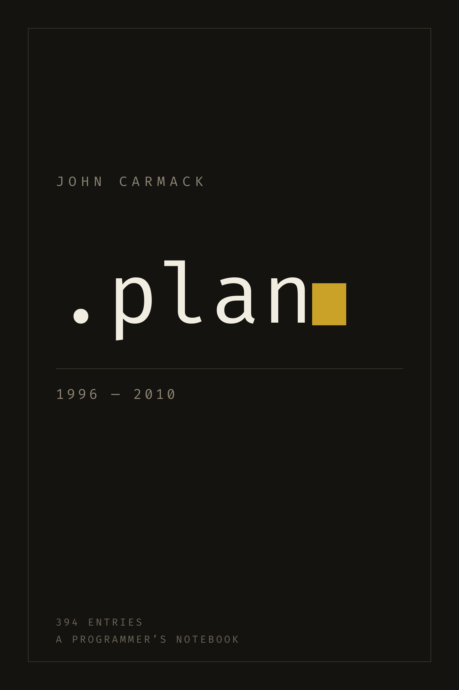
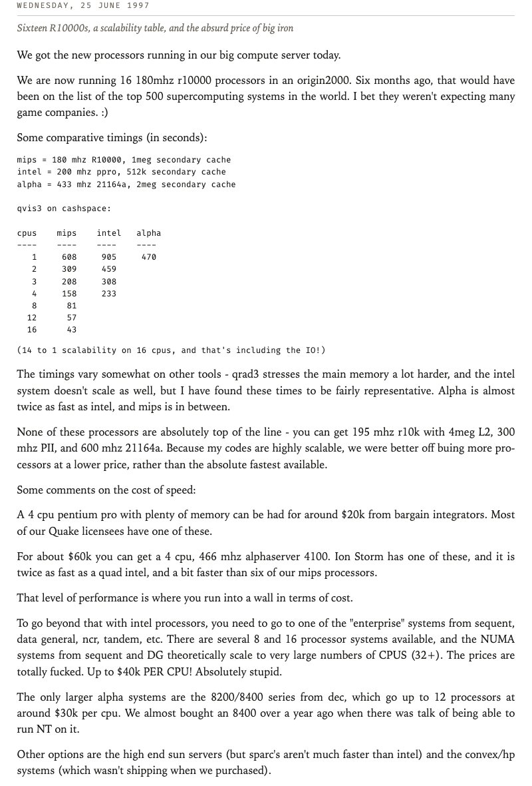

<h1 align="center">.plan</h1>
<p align="center">
  <em>The collected .plan files of John Carmack, 1996&ndash;2010, as a reading EPUB.</em>
</p>
<p align="center">
  
</p>

394 entries, typeset as a book: chapters are years, subchapters are dates, and every
entry carries a one-line editorial note saying what it covers.

**[Read the download page &rarr;](https://mx0r.github.io/carmack-plan-epub/)** &nbsp;·&nbsp;
[Download the EPUB directly](https://github.com/mx0r/carmack-plan-epub/releases/latest/download/carmack-plan.epub)

---

## What a .plan file was

Before blogs, Unix carried a small courtesy: leave a plain text file called `.plan` in
your home directory and anyone on the internet could read it by running `finger`
against your address. It was meant for "back at 3pm" notes.

From 1996 onward, John Carmack used his as a working notebook. It begins as terse Quake
changelogs — a line per bug fixed, a line per thing still broken — and grows into the
most detailed public record we have of how a first-rate engine programmer actually
thinks.

## What the book adds

- **Chaptered by year, subchaptered by date**, with a nested table of contents so you
  can jump straight to a day.
- **A one-line note under every date** (394 of them), plus a tagline and introduction
  for each year. These are editorial, written for this edition, and the front matter
  says so plainly. Everything else is his.
- **Typography suited to the material.** Prose reflows in a serif face; changelogs,
  tables and code stay verbatim in monospace.

<p align="center">
  
</p>

## How the text is handled

The archive mixes two incompatible kinds of writing, often inside one entry: prose
written as very long unwrapped lines, and changelogs hard-wrapped at terminal width
where the line breaks and column alignment carry meaning.

Measuring the corpus shows a clean split — block maximum line width is strongly
bimodal with a valley between 80 and 90 characters. The builder classifies each block
on that boundary:

| Block looks like | Rendered as |
| --- | --- |
| Long unwrapped lines (&ge; 88 cols) | Reflowing serif paragraphs, justified, hyphenated |
| Hard-wrapped lists, tables, code | Verbatim monospace, alignment preserved |
| A short line followed by `-----` | A sub-heading |
| A lone ALL-CAPS line | A sub-heading |

Verbatim blocks render each source line as its own element with a hanging indent, so a
line too long for a narrow iPad column wraps legibly instead of being clipped. This is
the single most common way EPUB code blocks break on small screens.

Three defects in the upstream archive are repaired during the build:

- **19 pairs of literal `[code]` / `[/code]` tags**, leftovers from a forum export, which
  would otherwise print as text. Stripped, with their contents forced to verbatim so
  table alignment survives.
- **Five `@Header@` markers** in the blog-era entries, converted to real sub-headings.
- **`johnc_plan_20101026.txt` is CP1252, not UTF-8.** Its smart quotes and dashes decode
  to replacement characters unless you fall back correctly.

One thing deliberately *not* repaired: `johnc_plan_20090427.txt` and
`johnc_plan_20090527.txt` are byte-identical in the archive. That is upstream, so both
are kept and the second is labelled as a duplicate rather than given an invented
summary.

## Repository layout

| Path | |
| --- | --- |
| `build_epub.py` | The generator. No dependencies beyond the standard library. |
| `validate_epub.py` | Structural checks on the built file. Exits non-zero on failure. |
| `summaries.tsv` | The 394 per-entry notes, `YYYYMMDD<TAB>text`. Edit freely. |
| `year_intros.tsv` | Per-year tagline and introduction, `YYYY<TAB>tagline<TAB>text`. |
| `by_day/` | The source archive, 394 `.txt` files. Vendored so builds are reproducible. |
| `fonts/` | Fira Code, vendored so the build does not depend on installed fonts. |
| `docs/` | Images used by this README. |
| `build/`, `dist/` | Generated. Git-ignored. |

The body serif is deliberately **not** embedded. The book asks for Iowan Old Style,
Charter, then Palatino — all of which Apple Books already ships — which keeps the file
small and lets your reader's own font preference win.

## Building it yourself

```bash
python3 build_epub.py          # -> dist/carmack-plan.epub
python3 validate_epub.py       # structural checks
```

Python 3.9+ and nothing else. `rsvg-convert` (`brew install librsvg`, or
`apt install librsvg2-bin`) is used to render the cover; without it the book still
builds, just without a cover image.

There is also a classification report, useful if you change the layout heuristics:

```bash
python3 build_epub.py --diagnose
```

## Releasing

Push a tag and CI builds, validates and publishes the EPUB as a release asset:

```bash
git tag v1.0.0 && git push origin v1.0.0
```

The workflow runs [epubcheck](https://github.com/w3c/epubcheck), the reference EPUB
validator, in addition to `validate_epub.py`, and refuses to publish if either fails.
Every push also builds and validates, attaching the result as a workflow artifact.

### Why validation is wired in this hard

An early build emitted the package document in the namespace
`http://www.w3.org/2000/opf`, which does not exist — the correct one is
`http://www.idpf.org/2007/opf`. Apple Books parses the package document first, failed to
recognise the root element, and silently refused to open the book. Every content file
was perfectly fine.

Worse, the checker at the time looked up manifest entries using the *builder's own*
namespace constant, so it agreed with the bug and reported a clean bill of health. The
book was self-consistently wrong.

`validate_epub.py` therefore writes every namespace URI out as a literal string, and
`epubcheck` runs in CI as an independent second opinion.

## Credits and licensing

The `.plan` text is **John Carmack's work**, reproduced verbatim. It is included here
for reading and preservation; no ownership is claimed over it, and nothing in this
repository grants a licence to it.

The `by_day/` files come from **[ESWAT/john-carmack-plan-archive](https://github.com/ESWAT/john-carmack-plan-archive)**,
which in turn mirrors the [.plan archive on
floodyberry.com](http://floodyberry.com/carmack/plan.html). Thanks to both for keeping
the text available.

[Fira Code](https://github.com/tonsky/FiraCode) is used under the SIL Open Font License
1.1 — see `fonts/README.md`.

Everything written for this edition — the two scripts, the CI workflow, the 394
per-entry summaries and the year introductions — is MIT licensed. See
[`LICENSE`](LICENSE), which sets out that split explicitly.

---

<p align="center"><sub>
Made with the help of 🤖 Claude — the typesetting pipeline, the per-entry
summaries and this README included.
</sub></p>
